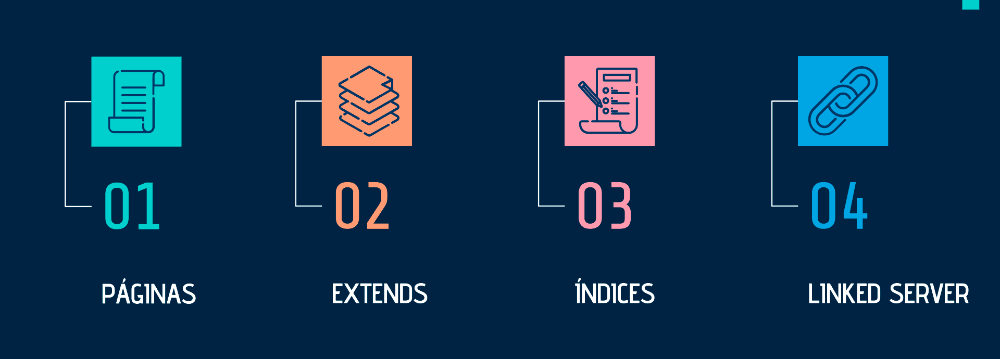
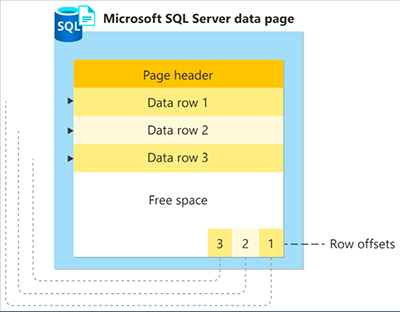
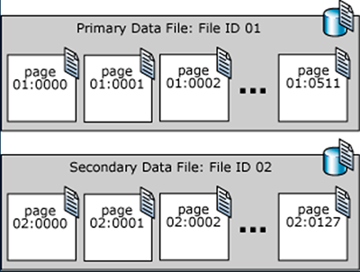
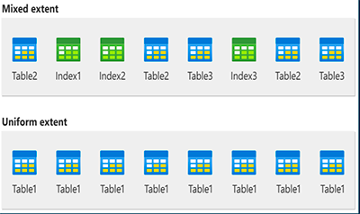

# Gerenciamento de Armazenamento


Este trabalho faz parte da disciplina Banco de Dados II do curso de Sistemas de Informação na [UNI7](https://www.uni7.edu.br/).

Link online da apresentação disponível no [Power Point](https://sempreuninassau-my.sharepoint.com/:p:/g/personal/56039246_sempreuni7_com_br/EeyNXZ91015BkNDIVru-wwEBwTbxO5DsdBbUbHw4Uew68g).
### Equipe
- Charlyane Araújo ([@charlyane-sa](https://github.com/charlyane-sa)) - [Páginas](#1-p%C3%A1ginas)
- Matheus Nascimento ([@mtlem](https://github.com/mtlem)) - [Extends](#2-extends)
- José Leão ([@valterleao](https://github.com/valterleao)) - [Índices](#3-%C3%ADndices)
- Hugo Júnior ([@hugojunior](https://github.com/hugojunior)) - [Linked Server](#4-linked-server)

# Conteúdo


## 1. Páginas
A unidade fundamental de armazenamento de dados no SQL Server é a página. O espaço em disco alocado a um arquivo de dados (.mdf ou .ndf) em um banco de dados é logicamente dividido em páginas numeradas de forma contígua de 0 a n.

Todas as páginas de dados têm o mesmo tamanho: 8kb. Cada página começa com um cabeçalho de 96 bytes, onde são armazenados as seguintes informações: número de página, tipo de página, quantidade de espaço livre na página e a ID de unidade de alocação do objeto que possui a página.

As linhas de dados são armazenadas em série na página, iniciando logo após o cabeçalho. Uma tabela de compensação da linha tem início no final da página, e cada tabela de compensação da linha contém uma entrada para cada linha na página. Cada entrada de compensação de linha armazena a distância do primeiro byte da linha em relação ao início da página, sendo a sua principal função ajudar o SQL Server a localizar linhas em uma página rapidamente. Essas entradas estão em sequência inversa da sequência das linhas na página.



As páginas de um arquivo de dados do SQL Server são numeradas em sequência, iniciando com zero (0) na primeira página do arquivo. Cada arquivo em um banco de dados tem um número de ID de arquivo exclusivo. Para identificar de forma exclusiva uma página em um banco de dados, são necessários ID do arquivo e número de página. O exemplo a seguir mostra os números de página em um banco de dados que tem um arquivo de dados primário de 4 MB e um arquivo de dados secundário de 1 MB.

Uma página de cabeçalho de arquivo é a primeira página que contém informações sobre os atributos do arquivo. Várias outras páginas do início do arquivo também têm informações de sistema, como mapas de alocação. Uma das páginas de sistema armazenada no arquivo de dados primário e no primeiro arquivo de log é uma página de inicialização de banco de dados que contém informações sobre os atributos do banco de dados.



Tipo de Página                   | Sumário
---------------------------------| ------
Dados                            | Linhas de dados com todos os dados, exceto os dados de texto, ntext, imagem, nvarchar(max), varchar(max), varbinary(max) e xml, quando o texto da linha estiver definido como ON.
Índice                           | Entradas de índice.
Texto/Imagem                     | Tipos de dados de objeto grande: dados text, ntext, image, nvarchar(max), varchar(max), varbinary(max) e xml. Colunas de comprimento variável quando a linha de dados exceder 8KB: varchar, nvarchar, varbinary e sql_variant.
GAM (Global Allocation Map)      | Informações sobre alocação de extensões.
PFS (Espaço livre na página)     | Informações sobre alocação de página e espaço livre disponível em páginas.
IAM (Mapa de alocação de índice) | Informações sobre extensões usadas por uma tabela ou índice por unidade de alocação.
BCM (Bulk changed map)           | Informações sobre extensões modificadas pelas operações em massa desde a última instrução BACKUP LOG por unidade de alocação.
DCM (Differential changed map)   | Informações sobre extensões modificadas desde a última instrução BACKUP DATABASE por unidade de alocação.

### Exemplos

**Código SQL:**
```sql
-- Deletando BD de teste caso já exista
use master;
DROP DATABASE IF EXISTS TestDB;

-- Criando BD de teste
CREATE DATABASE TestDB

-- Utilizar o BD de teste
USE TestDB

-- Testando os limites da criacao de paginas
CREATE TABLE Test (
    Descricao1 CHAR(4096),
    Descricao2 CHAR(4000)
);

-- Criando uma tabela com as linhas que utilizam ate 8KB
CREATE TABLE Test(
    Descricao1 CHAR(4000),
    Descricao2 CHAR(4000)
);

-- Inserindo valores na tabela
INSERT INTO Test (Descricao1, Descricao2) VALUES ('Descricao de teste 1', 'Descricao de teste 2');

-- Verificar espaco utilizado na tabela
sp_spaceused 'Test'

--Retornando a ID do banco de dados atual
SELECT DB_ID() AS [Database ID];
GO

-- Retornando informacoes da tabela
EXEC sp_help 'Test';

-- Retornando informacoes dos Bancos de dados ( DatabaseId, FileId)
SELECT * FROM sys.master_files

-- Retornando a quantidade de paginas alocadas
SELECT FILEPROPERTY ('TestDB', 'SpaceUsed') as 'Numero de paginas alocadas'

-- Retornando informacoes da pagina ( DatabaseId , FileId , PageId , Mode )
--'LIMITED' retorna valores NULL para todas as colunas de descricao; 'DETAILED' preenche as colunas de descricao
SELECT *
FROM sys.dm_db_page_info (5, 1, 1, DEFAULT);

-- Retornando as informacoes detalhadas das paginas ( DatabaseId , FileId , PageId , Mode )
-- 'LIMITED' retorna valores NULL para todas as colunas de descricao; 'DETAILED' preenche as colunas de descricao
SELECT *
FROM sys.dm_db_page_info (5, 1, 1, 'DETAILED');
```

## 2. Extends
Extends são a unidade básica em que o espaço é gerenciado. Uma extensão tem oito páginas fisicamente contíguas ou 64 KB. Isso significa que os bancos de dados do SQL Server têm 16 extensões por megabyte.

### O SQL Server tem dois tipos de extends:


1. Extensões uniformes que pertencem a um único objeto; todas as oito páginas na extensão podem ser usadas apenas pelo objeto proprietário.
2. Extensões mistas compartilhadas por até oito objetos. Cada uma das oito páginas da extensão pode pertencer a um objeto diferente.

### Gerenciar alocações de extensões e espaço livre
- As estruturas de dados do SQL Server que gerenciam alocações de extensão e controlam espaço livre têm uma estrutura relativamente simples. Ele oferece as seguintes vantagens:
- As informações de espaço livre são compactadas, portanto, poucas páginas contêm essas informações. Isso aumenta a velocidade reduzindo o número de leituras de disco exigidas para recuperar as informações de alocação.
- A maioria das informações de alocação não é encadeada. Isso simplifica a manutenção das informações de alocação.

### Gerir Alocações
O SQL Server usa dois tipos de mapas de alocação para registrar a alocação de extensões:
- GAM(Global Allocation map):
    - As páginas GAM registram quais extensões foram alocadas. Cada GAM cobre 64.000 extensões ou quase 4GB de dados. O GAM tem 1 bit para cada extensão no intervalo coberto.
- SGAM(Shared Global Allocation Map):
    - As páginas SGAM registram quais extensões estão sendo usadas atualmente como extensões mistas e também têm pelo menos uma página não usada

Cada extensão tem os padrões de bit a seguir configurados no GAM e no SGAM, com base em seu uso atual

Uso da extensão                              | Configuração de bit GAM | Configuração de bit SGAM
---------------------------------------------|-------------------------|-------------------------
Livre, não está sendo usado                  | 1                       | 0
Extensão uniforme ou extensão mista completa | 0                       | 0
Extensão mista com páginas livres            | 0                       | 1

### Acompanhar o espaço livre

As páginas PFS (Page Free Space) registram o status de alocação de cada página, se uma página individual foi alocada e a quantidade de espaço livre em cada página. O PFS tem 1 byte para cada página, que registra se a página está alocada e, em caso afirmativo, se ela está vazia, de 1 a 50% completa, de 51 a 80% completa, de 81 a 95% completa ou de 96 a 100% completa.

Após a alocação de uma extensão a um objeto, o Mecanismo de Banco de Dados usa as páginas PFS para registrar quais páginas na extensão são alocadas ou livres. Essas informações são usadas quando o Mecanismo de Banco de Dados precisa alocar uma página nova. A quantidade de espaço livre em uma página é mantida apenas para páginas heap e de texto/imagem. Ela é usada quando o Mecanismo de Banco de Dados precisa encontrar uma página com espaço livre disponível para manter uma linha recentemente inserida. Como o ponto em que a linha nova deve ser inserida é definido pelos valores de chave de índice, os índices não exigem que o espaço livre da página seja controlado.

Uma nova página PFS, GAM ou SGAM é adicionada ao arquivo de dados para cada intervalo adicional que ele acompanha. Portanto, há uma nova página PFS localizada a 8.088 páginas após a primeira página PFS e páginas PFS adicionais em intervalos de 8.088 páginas seguintes. Para ilustrar isso, a ID da página 1 é uma página PFS, a ID da página 8088 é uma página PFS, a ID da página 16176 é uma página PFS etc.

Há uma nova página GAM localizada a 64.000 extensões após a primeira página GAM e ela acompanha os intervalos de 64.000 extensões posteriores; a sequência continua em intervalos de 64.000 extensões. Da mesma forma, há uma nova página SGAM localizada a 64.000 extensões após a primeira página SGAM e páginas SGAM adicionais nos intervalos de 64.000 extensões seguintes.

### Gerenciar o espaço usado por objetos
- Uma página IAM mapeia as extensões em uma parte de 4 GB de um arquivo de banco de dados usada por uma unidade de alocação. Uma unidade de alocação deve ser de um dos três tipos
    - IN_ROW_DATA  -> Mantém uma partição de um heap ou um índice.
- LOB_DATA -> Contém tipos de dados de LOB (objeto grande), como xml, varbinary(max) e varchar(max).
    - ROW_OVERFLOW_DATA ->Mantém dados de comprimento variável armazenados em colunas varchar, nvarchar, varbinary ou sql_variant que excedem o limite de tamanho de linha de 8.060 bytes

### Exemplos

**Código SQL:**
```sql
-- Deletando BD de Filmes caso já exista
use master;
DROP DATABASE IF EXISTS Filmes;

-- Criando BD de Filmes
CREATE DATABASE Filmes;

-- Utilizar o BD de Filmes
USE Filmes;

CREATE TABLE Filmes (
    ID INT PRIMARY KEY IDENTITY(1,1),
    NomeFilme VARCHAR(255) NOT NULL,
    DataLancamento DATE,
    Diretor VARCHAR(255),
    Genero VARCHAR(100),
    IMDbNota DECIMAL(3, 1)
);

-- Inserir um filme
INSERT INTO Filmes (NomeFilme, DataLancamento, Diretor, Genero, IMDbNota)
VALUES ('O Poderoso Chefao', '1972-03-24', 'Francis Ford Coppola', 'Drama', 9.2);

-- Inserir outro filme
INSERT INTO Filmes (NomeFilme, DataLancamento, Diretor, Genero, IMDbNota)
VALUES ('Interestelar', '2014-11-07', 'Christopher Nolan', 'Ficcao Cientifica', 8.6);

-- Inserir mais um filme
INSERT INTO Filmes (NomeFilme, DataLancamento, Diretor, Genero, IMDbNota)
VALUES ('Era Uma Vez no Oeste', '1968-12-21', 'Sergio Leone', 'Western', 8.5);

-- Inserir outro filme
INSERT INTO Filmes (NomeFilme, DataLancamento, Diretor, Genero, IMDbNota)
VALUES ('O Senhor dos Aneis: A Sociedade do Anel', '2001-12-19', 'Peter Jackson', 'Fantasia', 8.8);

SELECT * FROM filmes;

EXEC sp_spaceused 'filmes';
```

## 3. Índices

## 4. Linked Server
Um **Linked Server** é uma funcionalidade no SQL Server que permite a criação de uma conexão para acessar e consultar dados de fontes de dados remotas, incluindo outros servidores SQL, bancos de dados de terceiros e fontes de dados externas. Isso possibilita a integração de dados de diversas origens, permitindo que você execute consultas distribuídas e operações de recuperação de dados de diferentes fontes, tudo a partir de uma única instância do SQL Server.​

### Vantagens
1. **Acesso a Dados Distribuídos:** A principal vantagem do Linked Server é a capacidade de acessar dados de fontes distribuídas, sejam outros servidores SQL Server ou fontes de dados externas. Isso permite a integração de dados de várias origens em um único ambiente.
2. **Facilidade de Consulta Distribuída:** O Linked Server simplifica a execução de consultas distribuídas, permitindo que você combine dados de diferentes fontes em consultas SQL, facilitando a análise e relatórios abrangentes.
3. **Centralização de Dados:** O Linked Server permite centralizar o acesso a dados de várias fontes em um único servidor SQL, simplificando o gerenciamento e a consulta de informações.
4. **Recursos de Negócios:** É útil para empresas que precisam acessar dados de sistemas legados ou fontes externas para suportar processos de negócios.

### Desvantagens
1. **Problemas de Segurança**: A configuração incorreta do Linked Server pode levar a problemas de segurança, como acesso não autorizado, exposição de dados confidenciais e vulnerabilidades de injeção de SQL.
2. **Complexidade de Configuração**: Configurar um Linked Server pode ser um processo complexo, exigindo conhecimento avançado e configurações precisas. Erros na configuração podem levar a problemas de desempenho e segurança.
3. **Desempenho Inconsistente**: O desempenho de consultas distribuídas por meio de um Linked Server pode ser afetado pela latência da rede e pela eficiência das consultas, o que pode resultar em desempenho inconsistente.
4. **Manutenção Complexa**: A manutenção de Linked Servers, especialmente em ambientes com muitos servidores e fontes de dados, pode ser desafiadora e requer atualizações periódicas para manter a integridade e a segurança.
5. **Dependência de Conectividade de Rede**: O funcionamento do Linked Server depende da conectividade de rede, o que pode causar problemas se a rede apresentar interrupções.

### Habilitando
#### Conexão no SQL Server
1. Abra o SQL Server Management Studio (SSMS).
2. Acesse a pasta "Server Objects" no Object Explorer.
3. Clique com o botão direito em "Linked Servers" e escolha "New Linked Server".
4. Configure as propriedades, incluindo nome, tipo, opções de segurança e servidor remoto.
5. Teste a conexão e, se bem-sucedido, crie o Linked Server.
6. Use o Linked Server para executar consultas distribuídas e acessar dados no servidor remoto.
7. Certifique-se de considerar a segurança e o desempenho ao fazê-lo.
#### Conexão com arquivos Excel
1. Baixe o Microsoft Access Database Engine Redistributable do site da Microsoft, escolhendo a versão compatível com a arquitetura do SQL Server (32 bits ou 64 bits).
3. Execute o instalador e siga as instruções.
4. Reinicie o serviço do SQL Server.

### Exemplos
#### 1. Consultando Google Maps
Neste exemplo, é realizada uma consulta direta à API XML do Google Maps usando o nome da cidade como entrada, a qual retorna informações adicionais e suas coordenadas geográficas.

**Dados utilizados:**
- [API do Google Maps](https://developers.google.com/maps)

**Código SQL:**
```sql
DECLARE @cidade VARCHAR(100) = 'Fortaleza'
DECLARE
    @obj INT,
    @Url VARCHAR(255),
    @resposta VARCHAR(8000),
    @xml XML

SET @Url = 'https://maps.googleapis.com/maps/api/geocode/xml?address=' + @cidade + '&sensor=false&key=[api-key-here]'

EXEC sys.sp_OACreate 'MSXML2.ServerXMLHTTP', @obj OUT
EXEC sys.sp_OAMethod @obj, 'open', NULL, 'GET', @Url, false
EXEC sys.sp_OAMethod @obj, 'send'
EXEC sys.sp_OAGetProperty @obj, 'responseText', @resposta OUT
EXEC sys.sp_OADestroy @obj

SET @xml = @resposta COLLATE SQL_Latin1_General_CP1251_CS_AS

SELECT
    @xml.value('(/GeocodeResponse/result/address_component/long_name)[1]', 'varchar(200)') AS Cidade,
    @xml.value('(/GeocodeResponse/result/formatted_address)[1]', 'varchar(200)') AS Cidade_Completo,
    @xml.value('(/GeocodeResponse/result/address_component/long_name)[2]', 'varchar(200)') AS Estado,
    @xml.value('(/GeocodeResponse/result/address_component/short_name)[2]', 'varchar(200)') AS Estado_Sigla,
    @xml.value('(/GeocodeResponse/result/address_component/long_name)[3]', 'varchar(200)') AS Pais,
    @xml.value('(/GeocodeResponse/result/address_component/short_name)[3]', 'varchar(200)') AS Pais_Sigla,
    @xml.value('(/GeocodeResponse/result/geometry/location/lat)[1]', 'varchar(200)') AS Latitude,
    @xml.value('(/GeocodeResponse/result/geometry/location/lng)[1]', 'varchar(200)') AS Longitude
```

#### 2. Consultando bancos remotos
Neste exemplo, realizamos uma conexão remota com dois bancos de dados diferentes: um para selecionar estados da região Sul e outro para os estados da região Sudeste do Brasil. No final, combinamos e listamos os resultados ordenados por nome.

**Dados utilizados:**
- [Banco de Estados](databases/2.tabela-estados.sql)

**Código SQL:**
```sql
SELECT *
FROM OPENROWSET(
    'SQLNCLI',
    'Server=192.168.56.101,1433;Database=localidades;Uid=hugojunior;Pwd=hugojunior;',
    'SELECT nome, uf, ''Sul do Brasil'' as regiao FROM estados WHERE uf IN(''PR'', ''RS'', ''SC'')'
) AS estados_sul

UNION

SELECT *
FROM OPENROWSET(
    'SQLNCLI',
    'Server=192.168.56.102,1433;Database=localidades;Uid=hugojunior;Pwd=hugojunior;',
    'SELECT nome, uf, ''Sudeste do Brasil'' as regiao FROM estados WHERE uf IN(''ES'', ''MG'', ''RJ'', ''SP'')'
) AS estados_sudeste

ORDER BY nome ASC;
```

#### 3. Consultando fontes múltiplas
Neste exemplo, listamos estados da região Nordeste de um banco local e os relacionamos com um banco remoto para filtrar estados brasileiros. Por fim, unimos esses resultados com estados estrangeiros de uma planilha do Excel e os ordenamos por país.

**Dados utilizados:**
- [Banco de Países](databases/1.tabela-paises.sql)
- [Banco de Estados](databases/2.tabela-estados.sql)
- [Excel de Estados estrangeiros](databases/4.tabela-estados-internacionais.xlsx)

**Código SQL:**
```sql
SELECT
    estados.id AS id,
    estados.nome AS nome,
    estados.uf AS uf,
    paises.nome AS pais
FROM
    estados
JOIN
    (
        SELECT *
        FROM OPENROWSET(
            'SQLNCLI',
            'Server=192.168.56.102,1433;Database=localidades;Uid=hugojunior;Pwd=hugojunior;',
            'SELECT * FROM paises'
        )
    ) AS paises
ON
    estados.pais = paises.id
WHERE
    estados.uf IN ('AL', 'BA', 'CE', 'MA', 'PB', 'PE', 'PI', 'RN', 'SE')

UNION

SELECT *
FROM OPENROWSET(
    'Microsoft.ACE.OLEDB.12.0',
    'Excel 12.0 Xml;Database=C:\4.tabela-estados-internacionais.xlsx;',
    'SELECT * FROM [estados_internacionais$]'
)

ORDER BY pais ASC;
```
